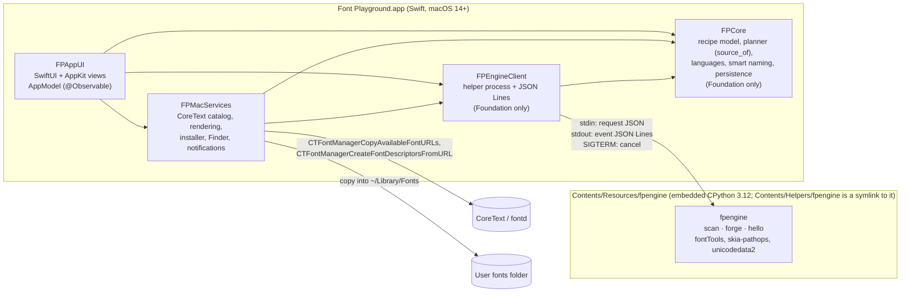

# Architecture

This document is **normative**. Specs in `docs/specs/` refine it. When a spec and this document disagree, fix one of them in the same PR; never leave the conflict in place. Decisions are recorded in `docs/adr/`.

## 1. Goals and non-goals

**Goals**

1. A native macOS app: menu bar, Settings, keyboard shortcuts, system appearance and accent, Finder integration, VoiceOver, and the current macOS look (built with the Xcode 26+ SDK).
2. **Preview honesty.** The preview draws text exactly as CoreText, and therefore every Mac app, will draw the forged font. There is no silent font fallback and no shaping the result cannot reproduce.
3. **Correct results with Apple's own fonts.** This covers PingFang, Hiragino, Apple SD Gothic Neo, Helvetica Neue, SF and others (see audit `ENGINE-*` and `CATALOG-*`).
4. Keep the proven fontTools engine and fix it, rather than rewriting it.
5. Feature parity with the original app's one-screen mixer (see the parity checklist in `docs/plan.md`).

**Non-goals (v1)**

- A Mac App Store or sandboxed build, iPad, or Windows/Linux builds of this app. Development, tests and CI run on macOS only (ADR-0014). The engine is plain Python, but it is built and tested only on macOS.
- Glyph editing, cross-font kerning, colour emoji, producing whole families, and per-language `locl` variants (as in the original).
- Keeping Apple AAT shaping (`morx`/`kerx`). It cannot be merged. We **detect it and guard against it** instead (ADR-0008).

## 2. Components



| Component | Language | Location | Platforms | Responsibility |
|---|---|---|---|---|
| `fpengine` | Python 3.12 | `engine/src/fpengine/` | any | Read faces (`scan`), plan and forge (`forge`). It is the single source of truth for what the engine can do with a face. |
| `FPCore` | Swift | `Packages/FontPlaygroundKit/Sources/FPCore` | macOS | Domain types, recipe state and operations (the port of `ForgeModel`), planner `source_of`, languages and samples, smart suggestions and naming, ForgeSpec emission, persistence formats. **No Apple UI or CoreText imports.** |
| `FPEngineClient` | Swift | `Packages/FontPlaygroundKit/Sources/FPEngineClient` | macOS | Launch the helper, send requests, decode events into `AsyncThrowingStream`, cancel, handle timeouts, capture stderr. |
| `fpctl` | Swift | `Packages/FontPlaygroundKit/Sources/fpctl` | macOS | Headless CLI: recipe in, scan and forge through the helper, report out. The end-to-end integration test that runs without UI. |
| `FPMacServices` | Swift | `Packages/FontPlaygroundMacKit/Sources/FPMacServices` | macOS | CoreText font enumeration and catalog store (cache, dedupe, hidden-face filter, change observation), CTFont creation for the preview (no fallback), `FontInstaller`, CoreText name-conflict lookups, Finder reveal. |
| `FPAppUI` | Swift | `Packages/FontPlaygroundMacKit/Sources/FPAppUI` | macOS | `AppModel`, all views, commands and menus, Settings. |
| App target | Swift | `App/` (XcodeGen `project.yml`) | macOS | `@main` app struct, Info.plist, entitlements (none), asset catalog and icon, helper embedding build phase. |

**Dependency rule:** `FPAppUI → {FPMacServices, FPEngineClient, FPCore}`, `FPMacServices → {FPEngineClient, FPCore}`, `FPEngineClient → FPCore`. Nothing depends on `FPAppUI`. `FPCore` depends on Foundation only. `FontPlaygroundKit` never imports AppKit, SwiftUI, CoreText or CoreGraphics, so the recipe logic and helper client are testable without UI, and every CoreText call lives in `FPMacServices` (§8).

## 3. Process model

- **One helper process per request** (`scan` or `forge`). A forge peaks at 0.7–0.95 GB (audit `ENGINE-9`, `NATIVE-3`), and that memory leaves with the process. Cancel is SIGTERM, then SIGKILL after 2 s.
- The UI process never imports Python.
- The helper runs `Contents/Helpers/fpengine/bin/python3 -I -B -m fpengine <command>` with `TMPDIR=<app caches>/tmp`. `-B` is what stops bytecode writes (`-I` ignores `PYTHON*` environment variables). The app sweeps that `tmp` folder at launch.
- **Physical location:** the runtime lives at `Contents/Resources/fpengine/`, and `Contents/Helpers/fpengine` is a relative symlink to it. codesign rejects the runtime's dotted directories (`lib/python3.12`, `*.dist-info`) under `Contents/Helpers` as malformed nested bundles (verified). Its size is about 80 MB on disk, about 30 MB compressed (ADR-0004).
- Development override: the environment variable `FP_ENGINE_PYTHON` points at a Python that can `import fpengine`, for example `engine/.venv/bin/python`. It is used by `fpctl`, by tests, and by debug builds when no embedded runtime is present.
- The protocol is specified in `docs/specs/helper.md` and as JSON Schema in `spec/protocol/`. It carries an integer `protocol` version. The app refuses a helper whose `hello` reports a different major protocol.

## 4. Data flow

1. **Discover.** `FPMacServices.FontDiscovery` lists font files from the union of three sources:
   - CoreText: `CTFontManagerCopyAvailableFontURLs` and the `CTFontCollectionCreateFromAvailableFonts` descriptors.
   - A recursive walk of `/System/Library/Fonts`, `/Library/Fonts` and `~/Library/Fonts`. Linked against SDK ≥ 26, CoreText lists only menu-visible fonts, so Times, LastResort and others are missing without the walk (verified).
   - The user's extra folders.

   It never calls name-based CoreText matching for fonts that are not installed, because that triggers downloads (audit `CATALOG-5`).
2. **Scan.** Files not in the cache, or whose `(size, mtime)` changed, are sent to `fpengine scan`, which streams one `FaceRecord` per face. Cache: `~/Library/Caches/io.github.kciceblue.fontplayground/catalog-v<N>.json`. Pruned on every scan.
3. **Catalog.** The store keeps visible faces only. It drops `hidden` faces (names starting with `.`) and dedupes by PostScript name, preferring the descriptor with the highest `kCTFontPriorityAttribute`: AssetsV2 = 60000 beats PrivateFrameworks = 10000. That value is read from the collection descriptors, never by a name lookup. The picker and all of `FPCore` work with `FaceRecord`s.
4. **Edit.** `AppModel` holds an `FPCore.Recipe` value. Every user action is a `Recipe` operation. Derived state (per-character `source_of`, missing characters, glyph estimate, suggestions and names) is recomputed synchronously in `FPCore`, which is fast enough for keystrokes. All of it uses **plannable coverage**, `coverage − unshaped` (contracts §3).
5. **Preview.** `FPMacServices.FontRendering` makes a `CTFont` for each material face from its URL, without registering it, with the cascade list set to `[LastResort]`. Every non-`wght` axis, including `opsz`, is pinned to its fvar default, which is what the engine instantiates. The preview is an attributed string built from `source_of` runs.
6. **Forge.** `Recipe.forgeSpec()` produces the protocol's `ForgeSpec` JSON. `FPEngineClient` runs `fpengine forge` into a temporary file. The report is shown, and the preview switches to the built font, loaded the same way from its URL.
7. **Save / Install.** Save a Copy… writes atomically to a user-chosen path. Install copies into `~/Library/Fonts` (see `docs/specs/mac-services.md`, ADR-0009).

## 5. Identity of a face

- **Runtime key:** `FaceKey(path: String, index: Int)`, where `path` is absolute and standardised, and `index` is the TTC/OTC face index (0 for single fonts).
- **Portable identity** (recipes, settings): `{postscriptName, family, style, path, index}`. On restore, resolve by `path+index`, then by `postscriptName`, then by `family+style`. Report what cannot be found; never drop it silently (audit `CRIT-2`, `CATALOG-7`, `ENGINE-8`).
- **Dedupe key** in the catalog: PostScript name (name ID 6), with a documented tie-break (audit `CATALOG-M1`).

## 6. Repository layout

```
AGENTS.md                      rules for agents and humans
Makefile                       single entry point for build/test/lint (WP-001)
docs/                          architecture, plan, specs, ADRs, research
spec/protocol/                 JSON Schemas for the helper protocol (normative)
spec/fixtures/                 conformance fixtures generated from Python, consumed by Swift tests; FROZEN.sha256 lists frozen ones
engine/                        uv project: pyproject.toml, uv.lock, src/fpengine/, tests/
tools/conformance/             fixture generator (Python)
Packages/FontPlaygroundKit/    SwiftPM: FPCore, FPEngineClient, fpctl (+ tests) — Foundation only
Packages/FontPlaygroundMacKit/ SwiftPM: FPMacServices, FPAppUI (+ tests) — macOS only
App/                           XcodeGen project.yml, Info.plist, Assets.xcassets / icon, entitlements
scripts/                       build-helper-runtime.sh, bundle/sign/notarize scripts
```

`reference/` was removed at v1.0.0 (WP-701). Citations of the form `reference/fontplayground-py/<path>:<line>` in specs and code comments refer to kciceblue/fontplayground at commit `14b6572e3c229de61063663c5c058a9a57864a3e`. The fixtures listed in `spec/fixtures/FROZEN.sha256` were generated from that app's UI logic; they are frozen, and the Swift code is now the canonical implementation of that logic.

## 7. Platform and toolchain baseline

| Item | Value | Why |
|---|---|---|
| Deployment target | macOS 14.0 | `@Observable`, `Inspector`, modern SwiftUI; still broad |
| Build SDK | Xcode 26 or newer (macOS 26+ SDK) | the main executable's SDK decides whether AppKit draws the current design (audit `CRIT-1`) |
| Architecture | arm64 (Apple silicon); x86_64 is not planned | the helper wheels are arm64; universal2 is backlog |
| Swift | tools-version 6.1, Swift 6 language mode, strict concurrency | builds with Xcode 26+ |
| Test framework | Swift Testing (`import Testing`) | ships with Xcode 26+ |
| Python (engine) | 3.12, managed by uv, `uv.lock` committed | engine tested on 3.12; the embedded runtime is python-build-standalone 3.12 |
| Project generation | XcodeGen from `App/project.yml`; `.xcodeproj` is not committed | agents edit YAML, not pbxproj |
| Bundle id | `io.github.kciceblue.fontplayground` | |
| App name | Font Playground | |

## 8. Cross-cutting rules

- **Never install fonts persistently in tests.** Use a temporary folder and `kCTFontManagerScopeProcess`, or URL descriptors.
- **Never do name-based CoreText matching** (`CTFontCreateWithName`, `CTFontDescriptorCreateMatchingFontDescriptors`, `NSFont(name:)`) for a name that is not known to be installed. It can start system font downloads. Create fonts from URLs. There are exactly two allow-listed exceptions, both enforced by `NameLookupSafetyTests` (mac-services.md):
  - the LastResort descriptor fallback, used when `/System/Library/Fonts/LastResort.otf` cannot be opened by URL;
  - WP-404's downloader, which runs only after explicit user confirmation.
- **Atomic writes** for every file the app writes: a temporary file in the same folder, fsync, then rename (audit `TOOLING-2`, `TOOLING-M5`).
- **All user-visible strings** go in a String Catalog (`Localizable.xcstrings`, `bundle: .module` inside packages). English only in v1.0; v1.1 adds Simplified Chinese and a Settings › Language choice (WP-508, `docs/specs/localisation.md`). **v1 exception:** engine data (report warnings, licence-note texts, helper messages, `unsupported_reason`) is shown as it comes. FPCore and FPMacServices return typed values that FPAppUI renders through its catalog (`ModelText`, WP-507).
- **No silent drops.** Anything filtered, skipped or unresolved is counted and surfaced in the UI or the report (fonts not found, unreadable files, AAT fonts excluded, glyphs not emboldened).
