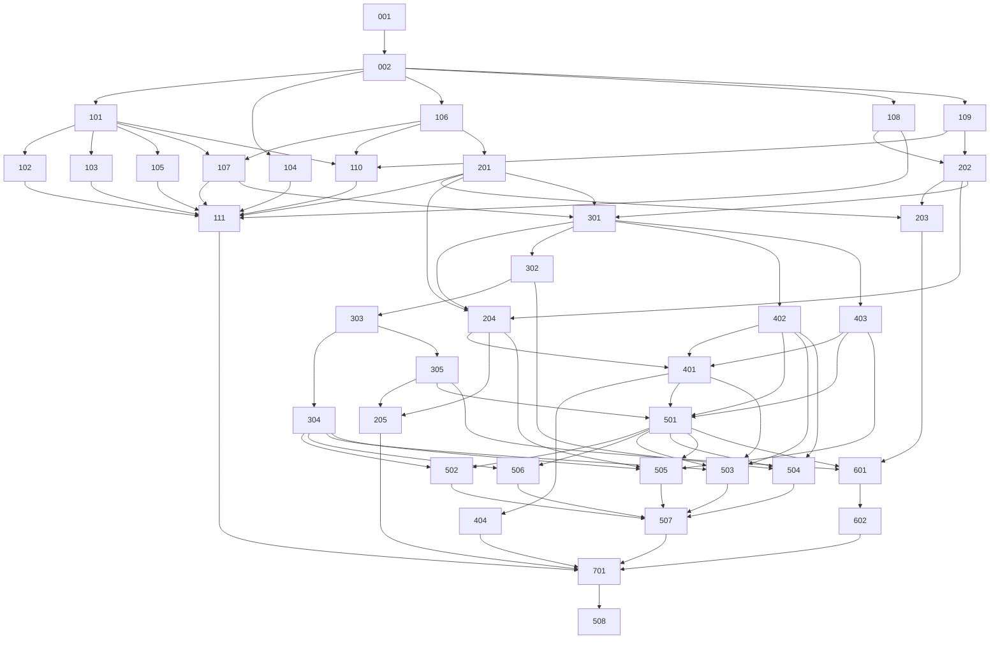

# Migration plan

From `kciceblue/fontplayground@14b6572` (PySide6 + fontTools, Windows-first) to a native macOS app. The architecture is in `docs/architecture.md`, and the decisions are in `docs/adr/`.

## 1. Strategy in one paragraph

Keep the engine and fix it: it is Qt-free and already runs on macOS, but it fails on Apple fonts. Put it behind a small JSON Lines helper process. Port the model logic to a Foundation-only Swift core that is verified against the Python behaviour with golden fixtures. Then build a native SwiftUI/AppKit/CoreText app on top. The order means every layer is testable before the next one depends on it. It also means most of the early work (engine, protocol, Swift core) can be verified on Linux in Codex cloud, and only the CoreText, AppKit and packaging work needs a Mac.

## 2. Milestones

| Milestone | Exit criteria (all must hold) | WPs |
|---|---|---|
| **M0 Foundation** | Clean clone → `make setup test` green on Linux and macOS. CI runs a Linux job (engine + Kit) and a macOS job (everything). | 001, 002 |
| **M1 Engine correct on Apple fonts** | Every engine WP merged. `make engine-apple-fonts` (macOS, real system fonts) green for the scenario matrix in `docs/specs/engine-correctness.md`. No audit `ENGINE-*` blocker or major is open. | 101–111 |
| **M2 Headless pipeline** | On Linux, `fpctl forge examples/fixtures/latin-cjk.fontrecipe --font-dir <dir from python -m fpengine.testing.make_fonts> --out /tmp/x.ttf` works; on macOS, `fpctl forge examples/latin-cjk.fontrecipe --out /tmp/x.ttf` (Helvetica Neue + PingFang SC) works. Conformance fixtures green in Swift. `FPCore` ports every behaviour listed in `docs/specs/core.md`. | 201–205, 301–305 |
| **M3 macOS services** | Catalog, rendering and installer services pass their macOS test suites. A debug harness lists PingFang, and never `.LastResort`. Install/uninstall round-trips in a temporary folder. | 401–404 |
| **M4 Feature-complete app** | Every item of the parity checklist (§6) checked on a debug build. Menu bar, shortcuts and VoiceOver audit done. | 501–507 |
| **M5 Release** | Notarized, stapled DMG. `spctl` accepts it. `--self-test` passes on a clean macOS 14 and on the current macOS. Main executable SDK ≥ 26. Licences bundled. `reference/` removed. Tag `v1.0.0`. | 601, 602, 701 |
| **M6 v1.1 Simplified Chinese** | Every FPAppUI, Info.plist and user-guide string has a reviewed `zh-Hans` translation. Settings › Language switches between English and 简体中文. The app shows as 字体混搭 on a Chinese Mac. Notarized DMG with `--self-test` passing. Tag `v1.1.0`. | 508 |

## 3. Work-package index

Environment (**Env**) records where each WP was verified when it was dispatched: `linux` meant Codex cloud (Linux, Python 3.12, Swift 6.1/6.2, no Apple frameworks), and `macos` meant macOS 14+ with Xcode 26+. Since ADR-0014 everything is built, tested and dispatched on macOS only; read `linux` as "needs no Apple frameworks". **Size:** S ≈ ½ day, M ≈ 1–2 days, L ≈ 3–5 days of agent work. **Findings** are IDs in `docs/research/macos-audit.md`.

| WP | Title | Spec | Depends on | Env | Size | Findings |
|---|---|---|---|---|---|---|
| **001** | Repository scaffold, Makefile, Codex setup script, CI (Linux + macOS) | foundation-release.md | — | linux + macos (needs network) | M | TOOLING-4, -6, -17, -21, -M1 |
| **002** | Import engine as `fpengine` (uv project, Qt-free, tests ported, POSIX-clean) | foundation-release.md | 001 | linux | M | TOOLING-3, -18 (engine side only; its sub-items go to 106/303/305/401), -23 |
| **101** | Normalise cmap after subsetting (+ the shared `Issue`/report plumbing) | engine-correctness.md | 002 | linux | S | ENGINE-1, N-1 |
| **102** | Drop non-kept and Apple bitmap tables before subsetting | engine-correctness.md | 002, 101 | linux | S | ENGINE-M2, ENGINE-12 |
| **103** | Synthesize a missing OS/2 table | engine-correctness.md | 002, 101 | linux | S | ENGINE-M1 |
| **104** | Feature closure: drop `aalt` and lookup-sharing features; disable the HarfBuzz repacker | engine-correctness.md | 002 | linux | S | ENGINE-3 |
| **105** | Robust synthetic bold (per-glyph fallback, report) | engine-correctness.md | 002, 101 | linux | S | ENGINE-4 |
| **106** | Face metadata v2 (script tags, AAT flags, hidden, PS name, licence fields, sanity) | engine-metadata.md | 002 | linux | M | ENGINE-2, CATALOG-2, ENGINE-10, NATIVE-6, CATALOG-8 |
| **107** | AAT guard in forge (per-script shaping check, errors and warnings) | engine-metadata.md | 101, 106 | linux | M | ENGINE-2, ENGINE-7, UI-M2, NATIVE-M1 |
| **108** | Name reading: Mac Roman English, Mac CJK encodings | engine-metadata.md | 002 | linux | S | CATALOG-3, CATALOG-M2, ENGINE-M4, UI-M1 |
| **109** | Unique, stable PostScript names; version and unique-ID fields; forged-font marker | engine-metadata.md | 002 | linux | S | ENGINE-M3, INSTALL-5 |
| **110** | Licence policy: fsType propagation, licence classes, report notes | engine-metadata.md | 101, 106, 109 | linux | S | ENGINE-5, CRIT-3 |
| **111** | Real-Apple-font regression suite (scenario matrix) | engine-correctness.md | 101–110, 201 | macos | M | all ENGINE-* except ENGINE-6, -11 (B-1, B-2); CRIT-7 |
| **201** | Protocol v1 (JSON Schemas) + `python -m fpengine` (`hello`, `scan`, `forge`) | helper.md | 002, 106 | linux | M | NATIVE-3, NATIVE-7, ENGINE-9 |
| **202** | Conformance fixture generator + fixtures | helper.md | 002, 108, 109 | linux | M | — |
| **203** | Embedded runtime build (`scripts/build-helper-runtime.sh`) | helper.md | 201, 202 | macos | M | TOOLING-M2, NATIVE-M4 |
| **204** | `FPEngineClient` (process, JSON Lines, cancel, timeouts) | helper.md | 001, 201, 202, 301 | linux | M | NATIVE-7 |
| **205** | `fpctl` headless CLI + example recipes | helper.md | 204, 305 | linux | S | — |
| **301** | `FPCore` foundations: `FaceRecord`, `FaceKey`, scripts and language groups, samples, text utils | core.md | 001, 107, 201, 202 | linux | M | — |
| **302** | `Mix` + planner `source_of` port, missing characters | core.md | 301 | linux | M | — |
| **303** | `Recipe` (port of `ForgeModel`): operations, rules, adjustments, ForgeSpec, glyph estimate | core.md | 302 | linux | L | ENGINE-8 |
| **304** | Smart: suggestions, naming conformance + PostScript-name port, nearest real weight | core.md | 303 | linux | M | ENGINE-4, CATALOG-11 |
| **305** | Persistence: `.fontrecipe`, settings, portable identity, Windows import + equivalence table | core.md | 303 | linux | M | CRIT-2, CRIT-3, CATALOG-7 |
| **401** | Font discovery + catalog store (CoreText, folders, cache, dedupe, hidden, change observation) | mac-services.md | 204, 301, 402, 403 | macos | L | CATALOG-1, -2, -6, -7, -9, -10, -M1, -M3, CRIT-5, -6, -9, NATIVE-9, TOOLING-M5, INSTALL-6 |
| **402** | Font rendering service (URL descriptors, LastResort cascade, opsz pin, built font) | mac-services.md | 301 | macos | M | CATALOG-4, NATIVE-M1, NATIVE-M2, NATIVE-M3 |
| **403** | `FontInstaller` + CoreText conflict checker | mac-services.md | 301, 109 | macos | L | INSTALL-* (INSTALL-13: wording only), TOOLING-2, TOOLING-7 |
| **404** | Downloadable fonts (Font Book hand-off; optional curated download) | mac-services.md | 401 | macos | S–M | CATALOG-5 |
| **501** | App shell: XcodeGen target, `AppModel`, window, menu bar, Settings, About/Acknowledgements | ui-shell.md | 001, 305, 401, 402, 403 | macos | L | UI-2, UI-3, UI-4, UI-11, UI-15, CRIT-8, TOOLING-M3 |
| **502** | Recipe column (font cards, main font, size/weight, add for language, replace/remove, colour by font) | ui-editing.md | 501, 402, 304 | macos | L | UI-5 |
| **503** | Font picker | ui-editing.md | 501, 401, 402, 304 | macos | L | UI-1, UI-14, CATALOG-2, CATALOG-11 |
| **504** | Preview pane (editable text, runs, missing characters, built-font mode, zoom) | ui-editing.md | 501, 302, 402 | macos | L | UI-M6, NATIVE-M1 |
| **505** | Build & install flow (name, Save a Copy…, Install/Update, progress/cancel, report, conflicts, Finder) | ui-shell.md | 501, 204, 304, 403 | macos | L | UI-9, UI-10, UI-M3, UI-M7, UI-M8, INSTALL-13 (Show in Finder), INSTALL-6 |
| **506** | Advanced inspector (scripts table, line spacing, defaults, last report) | ui-shell.md | 501, 304 | macos | M | UI-15 |
| **507** | Accessibility, String Catalog, Increase Contrast, keyboard audit | ui-shell.md | 502–506 | macos | M | UI-13, UI-M4, UI-6, UI-M5, UI-17 |
| **508** | Simplified Chinese localisation and the language setting (v1.1) | localisation.md | 507, 602; after 701 | macos | L | CRIT-10 (Simplified Chinese part) |
| **601** | Bundle, sign, notarize, DMG, `--self-test`, SDK check, release workflow | foundation-release.md | 203, 305, 501 | macos | L | TOOLING-1, -8, -9, -10, -11, -13, -14, CRIT-1 |
| **602** | User docs, licences/acknowledgements, Windows-migration notes | foundation-release.md | 601 | macos | S | TOOLING-11, CRIT-3, UI-12, UI-16 |
| **701** | Parity sign-off and cutover (remove `reference/`, freeze fixtures, tag v1.0.0) | foundation-release.md | all | macos | S | — |

**Backlog (not scheduled for v1):** B-1 optical size and `trak` fidelity (ENGINE-6). B-2 vertical metrics `vhea/vmtx/VORG` and `BASE` (ENGINE-11). B-3 universal2 build (TOOLING-10). B-4 undo/redo. B-5 recipe documents with Open Recent and drop-on-Dock (CRIT-4). B-6 HarfBuzz subsetting inside the helper for speed (NATIVE-10). B-7 in-app downloads beyond the curated list. B-8 localisation into Traditional Chinese, Japanese and Korean (CRIT-10; Simplified Chinese is WP-508). B-9 Homebrew cask. B-10 variable-font named instances as separate faces (CATALOG-12). B-11 try a forged font in other apps without installing, via session-scope registration (NATIVE-M7). B-12 symbol-cmap (3,0) fonts such as Webdings and Wingdings (ENGINE-1 verifier note). B-13 the picker shows a family's Chinese name first when the interface is Chinese. B-14 engine data (report warnings, licence notes, helper and installer errors) localised through their codes (D32).

**N-1** is a finding from spec writing, not from the audit: a merged cmap format 4 subtable over 65,535 bytes fails with `struct.error`. See `docs/research/macos-audit.md` §N-1.

## 4. Dependency graph and dispatch waves

Dispatch in waves. Everything in a wave can run in parallel, each in its own branch and PR. A WP is ready when every dependency is merged into `main`. The critical path is 001 → 002 → 106 → 107 → 301 → 302 → 303 → 305 → 501 → (502–506) → 507 → 701.

| Wave | WPs | Env | Notes |
|---|---|---|---|
| 1 | 001 | macos (Codex CLI on the Mac) or linux with agent internet | Needs network for `uv lock`. Sets the Make targets every later AC relies on |
| 2 | 002 | linux | |
| 3 | 101, 104, 106, 108, 109 | linux | 101 lands the shared `Issue`/report plumbing. Merge 101 before 104 (both edit `prepare.py`) |
| 4 | 102, 103, 105, 107, 110, 201, 202 | linux | 102/103/105 edit `prepare.py`: merge in numeric order and rebase. 103/106/107/108/110 each bump `READER_VERSION` in `face.py` (a one-line conflict: take the higher number + 1) |
| 5 | 111 (macos); 203 (macos); 301 (linux) | mixed | |
| 6 | 204, 302 (linux); 402, 403 (macos) | mixed | |
| 7 | 303 (linux); 401 (macos) | mixed | 303 is the largest core WP |
| 8 | 304, 305 (linux); 404 (macos) | mixed | |
| 9 | 205 (linux); 501 (macos) | mixed | 501 pre-creates the `AppModel` seams used by 502–506 (ui-editing.md §S2.3) |
| 10 | 502, 503, 504, 505, 506, 601 | macos | 5 UI PRs in parallel plus packaging. On conflicts in `AppModel.swift`, merge 502 → 503 → 504 → 505 → 506 |
| 11 | 507, 602 | macos | |
| 12 | 701 | macos | |
| 13 | 508 | macos | v1.1, after `v1.0.0` is tagged |

## 5. What changes versus the original app

| Area | Original (Windows) | New (macOS) |
|---|---|---|
| UI toolkit | PySide6 widgets, custom stylesheets, `⋯` menu | SwiftUI + AppKit, native controls, menu bar and Settings |
| Theme | Theme menu System/Light/Dark | Follows the system; an optional Appearance override lives in Settings |
| Font list | Walks `%WINDIR%\Fonts` and the per-user folder | CoreText enumeration + extra folders, hidden-face filter, PS-name dedupe |
| Preview | Qt text layout (bundled HarfBuzz), NoFontMerging | CoreText with LastResort cascade: exactly what Mac apps draw |
| Engine | In-process `QThread` | `fpengine` helper process, instant cancel |
| Install | Registry + GDI + `WM_FONTCHANGE` | Copy into `~/Library/Fonts`, Trash on uninstall |
| Settings / recipe | `%LOCALAPPDATA%\FontPlayground\*.json`, absolute paths | UserDefaults + `.fontrecipe` JSON with portable identity; one-time import of Windows `forge_last.json` |
| Distribution | `pip install`, `run.bat` | Notarized DMG |
| Licence | Warns only for "restricted" | fsType propagated, licence classes, notes in UI |

## 6. Feature-parity checklist (used by WP-701)

Each item names the WP that delivers it. WP-701 ticks every box on a release build. All 17 were ticked on 1.0.0 (4), 2026-09-30 ([parity sign-off](release/v1.0.0-parity.md)).

- [x] Choose main font…: a picker drawing each family in its own face, native names, a sample line per language, only fonts that draw the language well, search by English or native name, ↑/↓ try in the preview, Return uses it, Esc goes back (503)
- [x] The next step is offered when text has characters the main font cannot draw ("Choose a font for Chinese…") (502, 304)
- [x] ＋ Add a font for another language…; a font added for a language draws it even if a font above could (502, 303)
- [x] Each card says in plain words what its font draws (502, 301)
- [x] Size and Weight for fonts below the main font, reflected at once in the preview (502, 303)
- [x] Colour by font (502, 504)
- [x] Characters no font draws are listed under the preview, with "find a font" (504, 304)
- [x] Editable preview of the user's own text, drawn exactly as the result will draw (504, 402)
- [x] Install: build, install for the current user, preview switches to the built font; Update installed font after changes (505, 403)
- [x] Refuses to install over a font the system or the user already has under the same name; asks before replacing one it made earlier (505, 403)
- [x] Save a Copy… (505)
- [x] Advanced (Font › Show/Hide Advanced ⌥⌘I, and the toolbar): which font draws each script (editable), line-spacing source, default boldness and size, report of the last build (506)
- [x] Rescan Fonts, Add Font Folder…, Start Over in the menu bar; Appearance, extra folders and Show Settings Folder in Finder in Settings (501)
- [x] Result: one glyph per character, no unused glyphs, hinting removed, OpenType features kept per font, legacy `kern` converted to GPOS, fresh name table, vertical metrics from the main font (engine; 111)
- [x] Licence notes in report and UI (110, 505)
- [x] Variable fonts instanced at the chosen weight (engine; 111)
- [x] First launch after an update rescans only what changed (401)

## 7. Risk register

| Risk | Likelihood | Impact | Mitigation |
|---|---|---|---|
| Swift port of `ForgeModel` drifts from the original behaviour | M | H | Port the tests as spec (core.md §Porting map); conformance fixtures; parity checklist |
| Embedded Python signing or notarization problems | M | M | WP-203 and WP-601 dry-run notarization early with a stub app; ADR-0004 keeps the runtime simple |
| Font-heavy picker performance in SwiftUI | M | M | WP-503 has performance ACs; fallback to `NSTableView` is allowed by spec |
| Codex cloud cannot verify macOS WPs | H | M | macOS WPs are dispatched to Codex CLI on the Mac; macOS CI job; the Linux/macOS split in packages (ADR-0005) |
| Developer ID not available at M5 | M | M | Local builds use Apple Development signing; release is blocked only at M5 |
| Apple changes MobileAsset or font locations | L | M | CoreText enumeration, not paths; cache keyed by path+size+mtime with PS-name portable identity |
